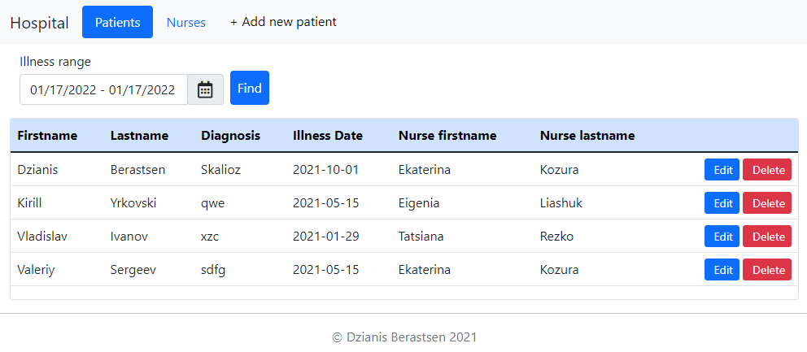
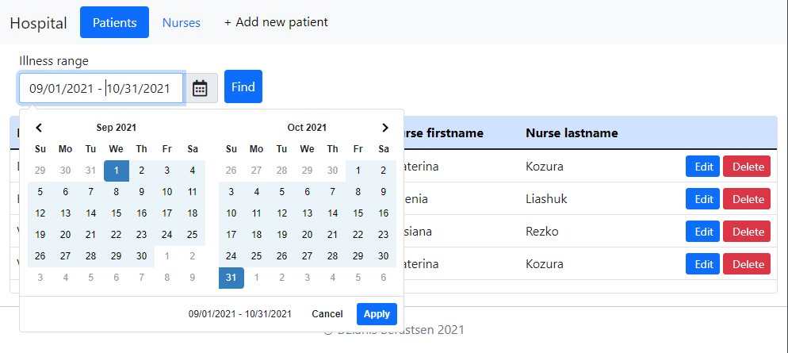
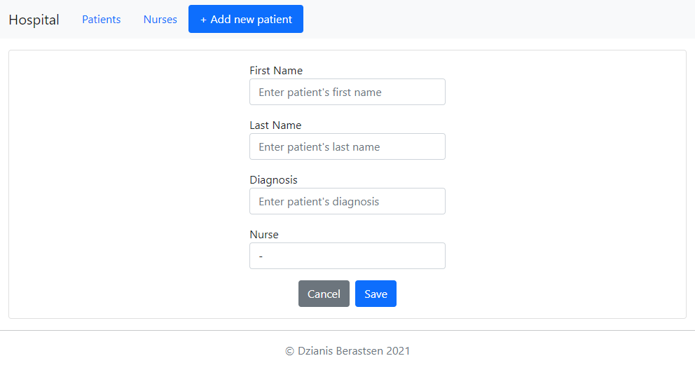
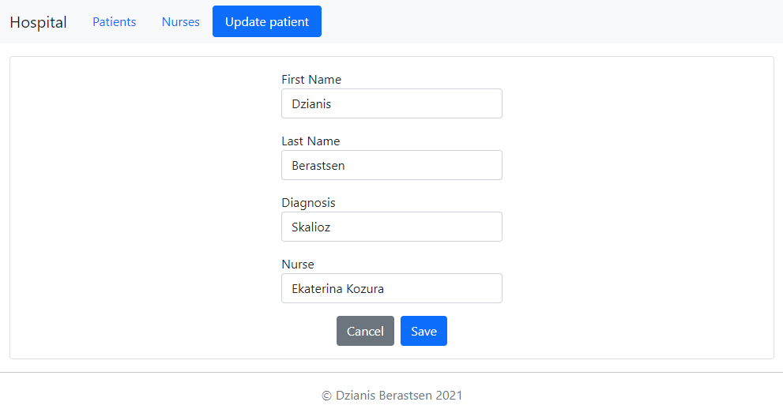
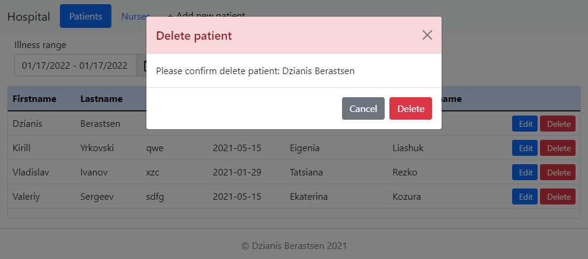
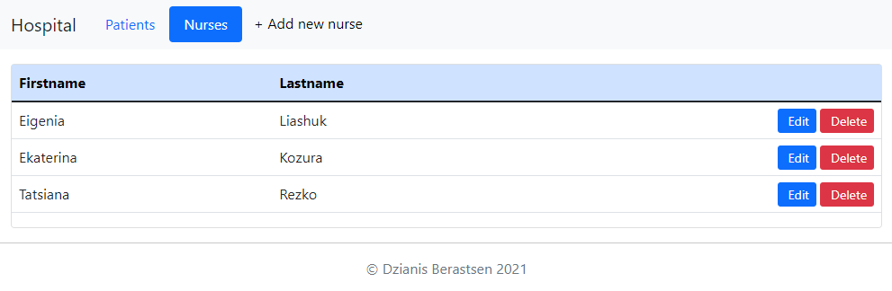
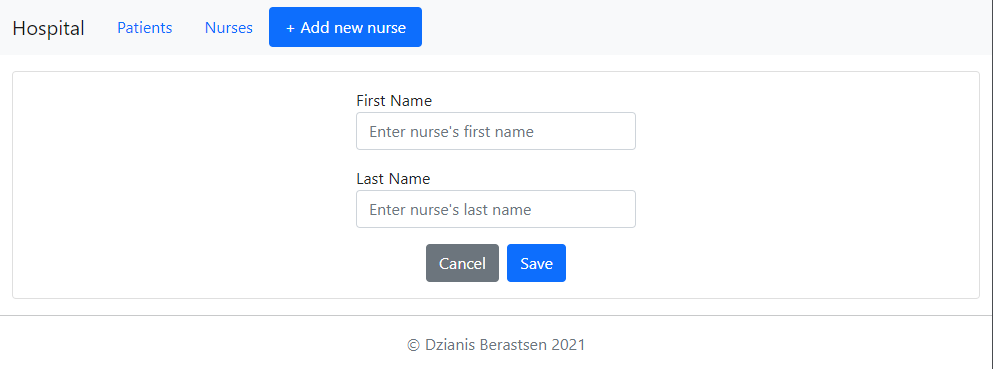
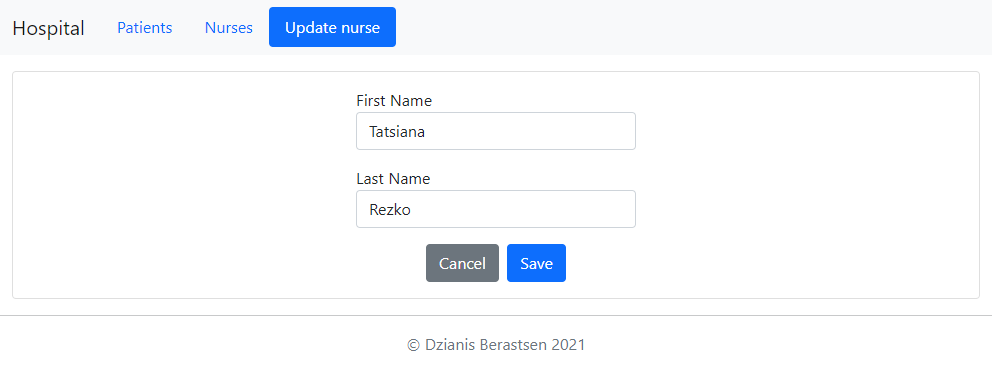
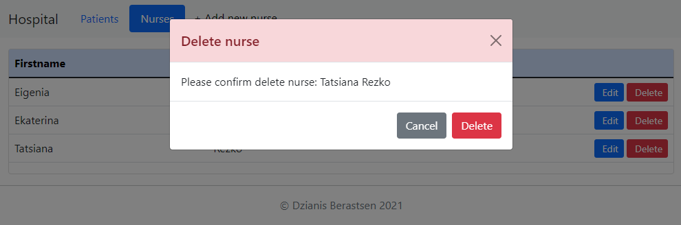

# Hospital

## About

This app can be used by a doctor in a hospital to keep track of their patients and staff attached to them. 

#Patients

## Viewing all patients

Main patients page contains a list of patients and nurses that apply to each patient.

The list displays the following columns: 
1. Patient's firstname.
2. Patient's lastname.
3. Diagnosis.
4. Illness date.
5. Nurse's firstname that apply to the following patient.
6. Nurse's lastname that apply to the following patient.

## Search patients by date 
    
User click on the calendar the form choosing date.

If no data is entered, then all players are displaying. The default filter shows all players. Data is updated after selecting filtering data and clicking the "Find" button.

## Adding patient

User click on the "+Add new patient" button.

The user enters data and clicks the "Save" button. If the data was entered incorrectly,
then the warning about incorrect data is displayed,
if the data was correct, then the patient will be added to the database.
If the patient was added successfully, the form for viewing the list of patients with updated data would be open.

## Editing patient

User chooses some patient and click "Edit" button.

The form for editing a patient is displayed, user edits data and clicks the "Save" button.
If the data was correct, then the patient will be added to the database. If the patient was edited successfully, the form for viewing the list of patients with updated data would be open.

## Deleting patient

User chooses some patient and click "Delete" button.

Checking for the possibility of deleting patient, 
if the patient can be deleted,the confirmation dialog for deleting is displayed
"Please confirm delete patient: "Patient's firstname and lastname"?".
User clicks the "Delete" button and the patient is deleting in the database.
If the patient was deleted successfully, the form for viewing the list of patients with updated data would be open.

# Nurses

## Viewing all nurses 

Main nurses page contains a list of nurses.

The list displays the following columns: 
1. Nurse's firstname.
2. Nurse's lastname.

## Adding nurse

User click on the "+Add new nurse" button.

The user enters data and clicks the "Save" button. If the data was entered incorrectly,
then the warning about incorrect data is displayed,
if the data was correct, then the nurse will be added to the database.
If the nurse was added successfully, the form for viewing the list of nurses with updated data would be open.

## Editing nurse

User chooses some nurse and click "Edit" button.

The form for editing a nurse is displayed, user edits data and clicks the "Save" button.
If the data was correct, then the nurse will be added to the database.
If the nurse was edited successfully, the form for viewing the list of nurses with updated data would be open.

## Deleting nurse

User chooses some nurse and click "Delete" button.

Checking for the possibility of deleting nurse,
if the nurse can be deleted,the confirmation dialog for deleting is displayed
"Please confirm delete nurse: "Nurses's firstname and lastname"?".
User clicks the "Delete" button and the nurse is deleting in the database.
If the nurse was deleted successfully, the form for viewing the list of nurses with updated data would be open.
